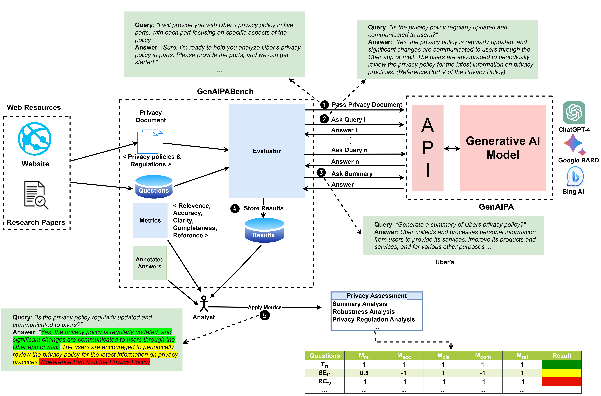

# GenAIPABench

**GenAIPABench: Benchmark for Generative AI-based Privacy Assistants**

## Abstract
Privacy policies on websites can be complex and lengthy, making them challenging for users to understand. Privacy assistants, powered by generative AI (genAI), offer a solution by simplifying these policies. However, the reliability of genAI in delivering accurate information remains a concern. GenAIPABench is introduced as a benchmark to evaluate the effectiveness of genAI-based Privacy Assistants (GenAIPAs). It encompasses a set of privacy-related questions, metrics for evaluating responses, and a tool for generating privacy document prompts to test system robustness. The benchmark was applied to leading genAI systems—ChatGPT-4, Bard, and Bing AI—revealing significant potential, alongside challenges in managing complex queries, ensuring consistency, and verifying source accuracy.


## High-Level Overview of GenAIPABench

The included figure illustrates the workflow and components of GenAIPABench, a benchmark framework designed to evaluate Generative AI-based Privacy Assistants (GenAIPAs). The process starts with the privacy document input to the GenAIPA model. The evaluator then interacts with the model through a series of queries related to the privacy document, which could range from specific details in the privacy policy to requests for a summary of the document. The GenAIPA, represented by leading genAI systems such as ChatGPT-4, Google BARD, and Bing AI, generates responses to these queries.

The responses are then assessed using a set of defined metrics that include relevance, accuracy, clarity, completeness, and reference quality. This assessment produces a set of results that are stored and can be used for further analysis, such as summary analysis, robustness analysis, and privacy regulation analysis. The results are visualized in a matrix that scores the GenAIPA's performance on each metric for various questions, providing a clear and comprehensive overview of its capabilities and areas for improvement.


## Citation

If you find our work useful, please cite our paper as follows:

```
@article{GenAIPABenchmark2024,
  author = {Hamid, Aamir and Samidi, Hemath Reddy and Finin, Tim and Pappachan, Primal and Yus, Roberto},
  title = {GenAIPABench: A Benchmark for Generative AI-based Privacy Assistants},
  journal = {Proc. Priv. Enhancing Technol.},
  volume = {2024},
  number = {3},
  year = {2024}
}
```


## Repository Directory Structure

    └── GenAIPABench
        └──Annotated Answers
            └── Privacy Policy Answers
	             └── annotated_answers_Airbnb  	
	             └── annotated_answers_Facebook
	             └── annotated_answers_Spotify 	
	             └── annotated_answers_Twitter
	             └── annotated_answers_Uber
            └── Regulation Answers
	             └── annotated_answers_CCPA  	
	             └── annotated_answers_GDPR
        └──Generated Answers
            └── Bard
                └── Bard_FAQ
                └── Bard_user_generated
            └── BingAI
                └── BingAI_FAQ
                └── BingAI_user_generated
            └── ChatGPT-4
                └── ChatGPT-4_FAQ
                └── ChatGPT-4_user_generated
        └── Privacy Documents
            └── Privacy Policy
                └── Airbnb_document
                └── Facebook_document
                └── Spotify_document
                └── Twitter_document
                └── Uber_document
            └── Regulations
                └── CCPA_document
                └── gdpr_document
        └── Questions
            └── Privacy Questions
                 └── Questions   	
	             └── Questions (Paraphrased)  
            └── Regulation Questions 
	             └── Questions
        └──  Results
	        └── Results_Bard
	             └── Results_adaptive  	
	             └── Results_orig
                 └── Results_regulations
                 └── Results_robust
                 └── Results_summary
                 └── Bard_metrics
            └── Results_BingAI
	             └── Results_adaptive  	
	             └── Results_orig
                 └── Results_regulations
                 └── Results_robust
                 └── Results_summary
                 └── BingAI_metrics
            └── Results_ChatGPT-4
                 └── Results_adaptive  	
	             └── Results_orig
                 └── Results_regulations
                 └── Results_robust
                 └── Results_summary
                 └── ChatGPT-4_metrics

## Directories' Description

### `Annotated Answers`
- **Privacy Policy Answers**: CSV files containing annotated responses to privacy policy questions for the privacy policies gathered from Airbnb, Facebook, Uber, Spotify, and Twitter (`annotated_answers_Airbnb, annotated_answers_Facebook, annotated_answers_Spotify, annotated_answers_Twitter and annotated_answers_Uber)`).
- **Regulation Answers**: CSV files with annotated answers for the compiled GDPR and CCPA regulation questions (`annotated_answers_CCPA, annotated_answers_GDPR`).

### `Generated Answers`

These documents contains compilation of answers (responses) generated by GenAIPA models, including Bard, BingAI, and ChatGPT-4. The data is categorized based on the type of queries:

#### Categories of Queries

- **`FAQ`**: Responses to generalized queries.
- **`user_generated`**: Responses to queries based on specific individual concerns.


### `Privacy Documents`
Contains the text documents of gathered privacy policies of Airbnb, Facebook, Uber, Spotiy and Twitter (`Airbnb_document, Facebook_document, Spotify_document, Twitter_document and Uber_document)`) and text related to privacy regulations (`CCPA_document, GDPR_document`).

### `Questions`
#### Privacy Questions (`Privacy Questions, Privacy Questions (Paraphrased)`)
This directory houses CSV files with privacy questions meticulously curated to evaluate GenAIPAs on a wide range of privacy-related topics. These questions, anchored in the ISO/IEC 29100:2011 privacy framework, span eight categories to reflect both broad user concerns and specific individual queries. Each category includes questions labeled `f1`, `f2`, `f3` for generalized queries (`FAQ`), and `u1` for queries based on specific individual concerns (`user_generated`). These questions are designed to cover a spectrum of complexities, from straightforward queries to those that demand a deep dive into privacy practices and policies.

To enhance the assessment of the GenAIPAs' understanding and accuracy in responses, the benchmark includes paraphrased versions of the queries. For both `FAQ` (`f1`, `f2`, `f3`) and `user_generated` (`u1`) queries across each category, three paraphrased variants are produced to maintain diversity in wording while keeping the original intent intact. AI tools are employed to generate these variants for `FAQ` queries, ensuring a wide spectrum of expressions. For `user_generated` queries, the three versions are carefully crafted by hand, aiming to more closely reflect the diverse ways in which users might phrase similar questions.

#### Questions on Regulations (`Regulation Questions`)
Contained within this directory are CSV files focused on privacy and data protection regulations, notably the GDPR and CCPA. A set of 12 questions, six per regulation, is provided to address key topics such as compliance obligations, penalties, definitions of personal and sensitive information, and the rights afforded to individuals under these laws. Paraphrased versions of these questions are also available to assess the GenAIPAs' ability to accurately interpret and respond to regulatory queries across different linguistic constructions.

This structured approach aims to rigorously evaluate GenAIPAs' proficiency in addressing the complex and nuanced aspects of privacy and data protection, mirroring the challenges presented by real-world scenarios of privacy concerns and regulatory compliance inquiries.

### `Results`
To evaluate the response quality of GenAIPA models, including Bard, BingAI, and ChatGPT-4, we've established metrics that encompass five key elements: `Relevance, Accuracy, Clarity, Completeness, and Reference`. These elements are fundamental to our privacy policy assessment framework. For each element, overall scores are assigned ranging from `0 to 10`, following the methodology detailed in the Metrics section of our paper. This directory contains the evaluation data for these elements, offering insights into the performance of each model across our experiments.


This directory includes such data for different experiments assessing the performance of GenAIPA models in:
- **Adaptive Recall (`Results_adaptive (Section 6.3)`)**: Assessing the ability to recall privacy policy knowledge. 
- **Quality of Responses to Privacy Policy Questions (`Results_orig (Section 6.1)`)**: Evaluating response quality to direct and paraphrased questions.
- **Quality of Responses to Regulation Questions (`Results_regulations (Section 6.4)`)**: Analyzing responses to GDPR and CCPA questions.
- **Robustness (`Results_robust (Section 6.2)`)**: Testing response consistency to paraphrased questions.
- **Summary Quality(`Results_summary (Appendix B.1)`)**: Examining the quality of privacy policy summaries.

**Metric Data**: The data contained in files (`Bard_metrics, BingAI_metrics, ChatGPT-4_metrics`) presents the normalized scores for each element of proposed evaluation metrics of GenAIPA models across four experiments (`Section 6.1, Section 6.2, Section 6.3, Appendix B.1`).


This README provides a structured overview of the GenAIPABench repository, integrating the abstract, repository structure, and detailed explanations following the directory structure and flow.


